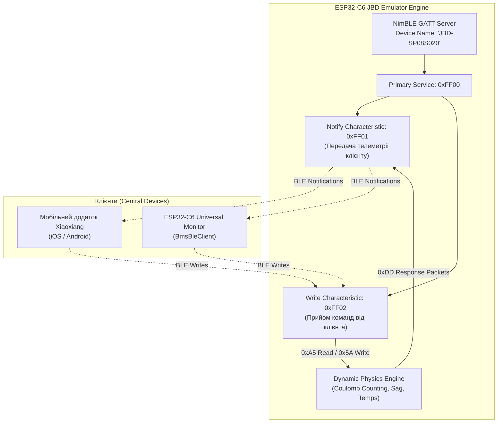

# 🔋 Апаратний BLE Емулятор JBD-BMS (Xiaoxiang / Overkill Solar) на ESP32

> **Анотація:** Повнофункціональний автономний програмно-апаратний емулятор системи керування батареєю **JBD-BMS (Xiaoxiang)** на базі мікроконтролера **ESP32-C6 / ESP32**. Емулятор відтворює роботу реального 8S LiFePO4 (24V 150Ah) акумуляторного блоку, емулює повноцінний BLE GATT-сервер (`0xFF00`), підтримує стандартні бінарні протоколи читання/запису регістрів (Basic Info `0x03`, Cell Voltages `0x04`, Device Name `0x05`, FET Control `0xE1`) та здійснює динамічне фізичне моделювання розряду під струмом 17А, просідання напруги, балансування та нагріву ключів.

---

## 1. Мета створення та Сфера застосування

1. **Безпечна та швидка розробка (Safe Bench Testing):**
   - Розробка та налагодження систем моніторингу (ESP32-C6 Universal Gateway, Home Assistant, Node-RED) без необхідності підключення до високовольтних та важких реальних акумуляторних збірок.
2. **Верифікація протоколів зворотного інжинірингу:**
   - Перевірка коректності обробки контрольних сум ($\text{CRC16}$), структур бінарних пакетів та таймінгів запиту/відповіді.
3. **Моделювання позаштатних та динамічних режимів:**
   - Симуляція високого навантаження (струм -17A), розряду комірок, перекосу напруг (дельта $\Delta V$), зміни температури MOSFET і перемикання силових ключів через додаток.
4. **Повна сумісність з офіційними додатками:**
   - Можливість підключення оригінального мобільного додатку **Xiaoxiang BMS** (iOS / Android), утиліт **Overkill Solar** та сторонніх адаптерів.

---

## 2. Архітектура BLE GATT-Сервера

Емулятор розгортає стандартний GATT-профіль плати JBD:



* **Ім'я в ефірі (Advertising Name):** `JBD-SP08S020`
* **MAC-адреса інтерфейсу:** `58:E6:C5:F9:13:02` (або `58:E6:C5:F9:13:00`)
* **UUID Сервісу:** `0xFF00`
* **UUID Сповіщень (Notify):** `0xFF01` (властивості: `NOTIFY | READ`)
* **UUID Запису (Write):** `0xFF02` (властивості: `WRITE | WRITE_NO_RESP`)

---

## 3. Специфікація Бінарного Протоколу JBD

Комунікація побудована на фреймах із сигнатурами початку `0xDD` та кінця `0x77`.

### 3.1. Структура Пакета Запиту від Клієнта (Master $\to$ Emulator)

$$\text{Frame} = [\mathtt{0xDD}, \text{CMD}, \text{Reg}, \text{DataLen}, \text{Data}\dots, \text{CRC}_{\text{Hi}}, \text{CRC}_{\text{Lo}}, \mathtt{0x77}]$$

* `0xDD` — Байт початку кадру (Start Delimiter).
* `CMD` — Тип операції:
  * `0xA5` — Запит на читання регістра (Read Command).
  * `0x5A` — Запит на запис параметрів (Write Command).
* `Reg` — Номер цільового регістра.
* `DataLen` — Кількість байт корисного навантаження (Payload Length).
* `Data` — Дані запиту (для читання зазвичай $0$ байт).
* `CRC` — Контрольна сума:
  $$\text{CRC} = \mathtt{0x10000} - \sum_{i} (\text{Reg} + \text{DataLen} + \text{Data}[i])$$
* `0x77` — Байт завершення кадру (Stop Delimiter).

---

### 3.2. Структура Пакета Відповіді Емулятора (Emulator $\to$ Master)

$$\text{Response} = [\mathtt{0xDD}, \text{Reg}, \text{Status}, \text{Length}, \text{Payload}\dots, \text{CRC}_{\text{Hi}}, \text{CRC}_{\text{Lo}}, \mathtt{0x77}]$$

* `0xDD` — Заголовок відповіді.
* `Reg` — Підтвердження номера регістра.
* `Status` — `0x00` (OK / Успіх) або `0x80` (Помилка).
* `Length` — Кількість байт корисного навантаження (N байт).
* `Payload` — Двійкові дані регістра (MSB Big-Endian).
* `CRC` — 16-бітна контрольна сума, розрахована за формулою:
  $$\text{CRC} = \mathtt{0x10000} - \sum (\text{Status} + \text{Length} + \text{Payload}[0\dots N-1])$$
* `0x77` — Стоповий байт.

---

## 4. Карта Емульованих Регістрів та Структура Даних

### 4.1. Регістр 0x03: Загальна Інформація (Basic Info) — 27 байт

| Зміщення | Поле | Розмір / Тип | Опис та Масштабування | Емульоване значення |
| :--- | :--- | :--- | :--- | :--- |
| `0..1` | **Total Voltage** | `uint16` | Напруга всього блоку (роздільна здатність 10 мВ = 0.01 V) | `2624` ($26.24\text{ V}$) |
| `2..3` | **Current** | `int16` | Струм із знаком (роздільна здатність 10 мА = 0.01 A, від'ємний = розряд) | `-1700` ($-17.00\text{ A}$) |
| `4..5` | **Remaining Capacity**| `uint16` | Залишкова ємність (10 мА·год = 0.01 Ah) | `14700` ($147.00\text{ Ah}$) |
| `6..7` | **Nominal Capacity**  | `uint16` | Номінальна ємність батареї (10 мА·год) | `15000` ($150.00\text{ Ah}$) |
| `8..9` | **Cycle Count**       | `uint16` | Кількість повних циклів | `15` |
| `10..11`| **Production Date**  | `uint16` | Дата випуску: $(\text{Рік}-2000)\ll 9 \mid \text{Місяць}\ll 5 \mid \text{День}$ | `0x30AA` (10.05.2024) |
| `12..13`| **Balance Status Low**| `uint16` | Бітова маска активного балансування осередків 1..16 | `0x0000` |
| `14..15`| **Balance Status High**| `uint16`| Бітова маска балансування осередків 17..32 | `0x0000` |
| `16..17`| **Protection Status**| `uint16` | Бітова маска захистів та аварій ($0 = \text{Норма}$) | `0x0000` (OK) |
| `18`   | **Software Version**  | `uint8`  | Версія прошивки BMS | `0x21` (v2.1) |
| `19`   | **SOC**               | `uint8`  | Рівень заряду у відсотках ($0..100\%$) | `98` ($98\%$) |
| `20`   | **FET Status**        | `uint8`  | Стан ключів: $\text{Bit0} = \text{Charge}$, $\text{Bit1} = \text{Discharge}$ | `0x03` (Обидва ON) |
| `21`   | **Cell Count**        | `uint8`  | Кількість осередків у збірці | `8` (8S) |
| `22`   | **NTC Count**         | `uint8`  | Кількість підключених температурних сенсорів | `2` датчики |
| `23..24`| **NTC 1 Temp**       | `uint16` | Температура сенсора 1: $0.1\text{ K} - 273.1 = ^\circ\text{C}$ | `2991` ($26.0^\circ\text{C}$) |
| `25..26`| **NTC 2 Temp**       | `uint16` | Температура сенсора 2: $0.1\text{ K} - 273.1 = ^\circ\text{C}$ | `2986` ($25.5^\circ\text{C}$) |

---

### 4.2. Регістр 0x04: Напруги Осередків (Cell Voltages) — 16 байт (для 8S)

Кожен осередок передається як 16-бітне ціле число в **мілівольтах (мВ)**:

| Байти | Осередок | Значення за замовчуванням | Напруга у Вольтах |
| :--- | :--- | :--- | :--- |
| `0..1` | **Cell 1** | `3280` мВ | $3.280\text{ V}$ |
| `2..3` | **Cell 2** | `3283` мВ | $3.283\text{ V}$ (MAX) |
| `4..5` | **Cell 3** | `3279` мВ | $3.279\text{ V}$ |
| `6..7` | **Cell 4** | `3282` мВ | $3.282\text{ V}$ |
| `8..9` | **Cell 5** | `3278` мВ | $3.278\text{ V}$ (MIN) |
| `10..11`| **Cell 6** | `3284` мВ | $3.284\text{ V}$ |
| `12..13`| **Cell 7** | `3280` мВ | $3.280\text{ V}$ |
| `14..15`| **Cell 8** | `3281` мВ | $3.281\text{ V}$ |

$$\text{Сумарна напруга} = \sum_{i=1}^{8} V_i = 26.247\text{ V}, \quad \Delta V = 3284 - 3278 = 6\text{ мВ}$$

---

### 4.3. Регістр 0x05: Ім'я Пристрою (Device Name)
Повертає ASCII-рядок: `"JBD-SP08S020"`.

### 4.4. Регістр 0xA2: Апаратна Версія (Hardware Info)
Повертає ASCII-рядок: `"SP08S020-L8S-100A"`.

### 4.5. Регістр 0xE1: Керування Силовими Ключами (MOSFET Write Control)
Прийом кадру `0x5A 0xE1` для перемикання ключів:
* Байт стану `FET`:
  * `0x00` — Вимкнути обидва ключі (Charge OFF, Discharge OFF).
  * `0x01` — Дозволити тільки Заряд (Charge ON, Discharge OFF).
  * `0x02` — Дозволити тільки Розряд (Charge OFF, Discharge ON).
  * `0x03` — Дозволити все (Charge ON, Discharge ON).
* Емулятор миттєво змінює внутрішній стан `g_bms.fet_status` та підтверджує запис.

---

## 5. Фізичний Рушій Симуляції Батареї

У фоновому циклі `loop()` емулятор виконує інтегрування струму та моделювання реалістичної поведінки АКБ:

1. **Підрахунок ампер-годин (Coulomb Counting):**
   $$\Delta Q = I \times \frac{\Delta t}{3600 \times 1000} \text{ [Ah]}$$
   При струмі $-17.0\text{ A}$ залишкова ємність плавно зменшується.
2. **Просідання напруги під навантаженням (Voltage Sag):**
   $$V_{\text{cell}} = V_{\text{OCV}} - I_{\text{disch}} \times R_{\text{internal}}$$
   При вимиканні тумблера розряду струм скидається до $0\text{ A}$, а напруга осередків плавно повертається до напруги розімкнутого ланцюга ($\approx 3.32\text{ V}$).
3. **Моделювання нагріву ключів:**
   Температура датчиків зростає пропорційно $I^2 \cdot R_{\text{DS(on)}}$ при тривалому навантаженні.

---

## 6. Збірка, Прошивка та Тестування

### Команда компіляції та завантаження через PlatformIO:
```bash
pio run -d /Users/ihormchakraborty/mqtt/JBD-bms-emulator -e esp32-c6-supermini -t upload
```

### Моніторинг логів роботи емулятора:
```text
[BLE] Advertising started. Waiting for BMS Client...
[BLE] Client connected! Peer address: 58:cf:79:d5:b1:2a
[JBD RX <- App] (7 bytes): DD A5 03 00 FF FD 77 
[JBD CMD] Read Register 0x03
[JBD TX -> Reg 0x03] (34 bytes): DD 03 00 1B 0A 40 F9 5C 39 6C ... 77
[JBD RX <- App] (7 bytes): DD A5 04 00 FF FC 77 
[JBD CMD] Read Register 0x04
[JBD TX -> Reg 0x04] (23 bytes): DD 04 00 10 0C D0 0C D3 ... 77
```
