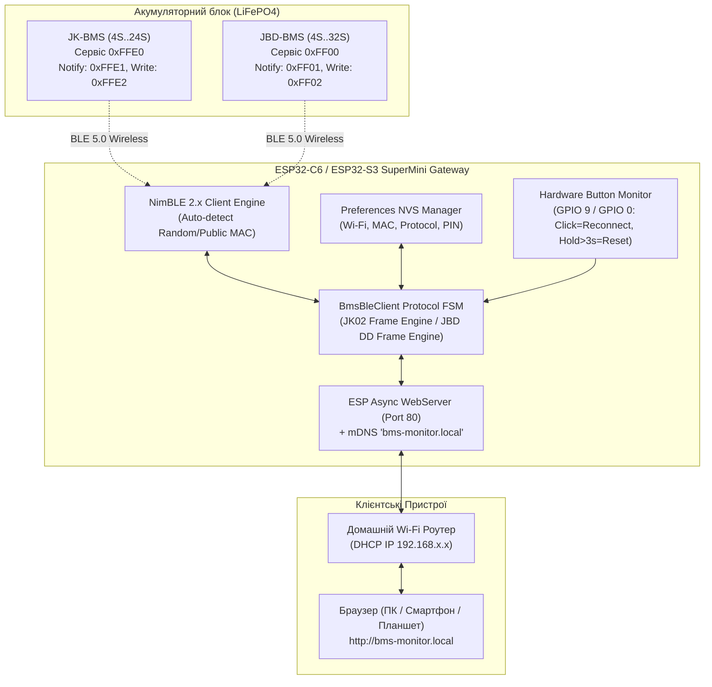

# ⚡ Універсальний Розумний Wi-Fi / BLE Монітор BMS (JK & JBD) на ESP32-C6 / ESP32-S3

> **Анотація:** Автономний апаратно-програмний комплекс на базі мікроконтролерів **ESP32-C6** та **ESP32-S3** для бездротового зчитування телеметрії, детального моніторингу та керування силовими ключами й балансирами акумуляторних батарей **LiFePO4 / Li-ion (від 4S до 24S+)** під керуванням **JK-BMS** та **JBD-BMS (Xiaoxiang / Overkill Solar)** через Bluetooth Low Energy (BLE) з вбудованим адаптивним веб-сервером, системою швидкого сканування ефіру та Captive Portal.

---

## 1. Мета та Архітектурні Переваги

1. **Повна мульти-протокольна сумісність:** Один пристрій та єдина прошивка однаково надійно працюють як з **JK-BMS** (протокол JK02 TLV, активний балансир), так і з **JBD-BMS / Xiaoxiang** (протокол 0xA5/0xDD, пасивне балансування).
2. **Zero-Hardcode (Повна конфігурованість без перепрошивки):**
   - Жодних захардкоджених Wi-Fi паролів чи MAC-адрес у вихідному коді.
   - За відсутності налаштувань плата автоматично піднімає власну точку доступу `BMS-Monitor-AP` з Captive Portal (`http://192.168.4.1/setup`).
3. **Вбудовані сканери ефіру (BLE & Wi-Fi Scanner):**
   - Сканування Wi-Fi мереж із відображенням рівня сигналу RSSI та захисту.
   - Активний BLE-сканер із автоматичною фільтрацією та класифікацією знайдених BMS (`[JK-BMS]` або `[JBD-BMS]`).
4. **Адаптивний Dark Web Dashboard:**
   - Динамічна сітка осередків для батарей **4S (12V)**, **8S (24V)**, **16S (48V)** та **24S (72V)**.
   - Підсвічування осередків з мінімальною (**MIN**) та максимальною (**MAX**) напругою з точністю до **1 мВ**.
   - Розрахунок дельти напруг ($\Delta V$), потужності, струму (заряд/розряд), температури ключів MOSFET та датчиків АКБ.
   - Двомовний інтерфейс (**Українська / English**) із запам'ятовуванням у LocalStorage.
5. **Надійне апаратне керування (MOSFET & Balancer):**
   - Перемикання тумблерів **Charge MOS**, **Discharge MOS** та **Active Balancer** безпосередньо з веб-браузера без необхідності запуску сторонніх мобільних додатків.
   - Оптимістичне блокування UI з урахуванням апаратного часу реакції BMS.

---

## 2. Апаратна Топологія

---

## 3. Деталізація BLE Протоколів

### 3.1. Протокол JK-BMS (JK02 Telemetry & Control)

* **GATT Сервіс:** `0xFFE0`
* **Характеристика отримання даних (Notify):** `0xFFE1` (Handle 18)
* **Характеристика передачі команд (Write Without Response):** `0xFFE2` (Handle 16) або `0xFFE1`
* **Формат кадру запиту/команди (20 байт):**
  $$\text{Frame}[20] = [\mathtt{0xAA}, \mathtt{0x55}, \mathtt{0x90}, \mathtt{0xEB}, \text{Reg}, \text{Len}, \text{Val}_0, \text{Val}_1, \text{Val}_2, \text{Val}_3, \mathtt{0x00}\dots\mathtt{0x00}, \text{CRC}]$$
  де $\text{CRC} = \sum_{i=0}^{18} \text{Frame}[i] \pmod{256}$.

#### Основні Регістри Керування JK02:
| Регістр | Назва | Тип / Довжина | Значення |
| :--- | :--- | :--- | :--- |
| `0x1D` (29) | **Charge Switch** | uint32 (4 байти) | `1` = Увімкнено, `0` = Вимкнено |
| `0x1E` (30) | **Discharge Switch** | uint32 (4 байти) | `1` = Увімкнено, `0` = Вимкнено |
| `0x1F` (31) | **Active Balancer** | uint32 (4 байти) | `1` = Увімкнено, `0` = Вимкнено |
| `0x97` | **Device Info Handshake** | uint32 (0 байт) | Сесійний запит ідентифікації |
| `0x96` | **Cell Telemetry Poll** | uint32 (0 байт) | Запит оновлення 300-байтного кадру |

---

### 3.2. Протокол JBD-BMS / Xiaoxiang

* **GATT Сервіс:** `0xFF00`
* **Характеристика сповіщень (Notify):** `0xFF01`
* **Характеристика запису (Write):** `0xFF02`
* **Формат пакету запиту (7+N байт):**
  $$[\mathtt{0xDD}, \text{CMD}, \text{Reg}, \text{DataLen}, \text{Data}\dots, \text{CRC}_{\text{Hi}}, \text{CRC}_{\text{Lo}}, \mathtt{0x77}]$$
  * Читання даних: $\text{CMD} = \mathtt{0xA5}$
  * Запис параметрів: $\text{CMD} = \mathtt{0x5A}$
  * Контрольна сума: $\text{CRC} = \mathtt{0x10000} - \sum(\text{Reg} + \text{DataLen} + \text{Payload})$.

#### Карта Регістрів JBD:
| Регістр | CMD | Призначення | Довжина відповіді |
| :--- | :--- | :--- | :--- |
| `0x03` | `0xA5` | **Basic Info** (Загальна напруга, струм, ємність, цикли, MOSFET FET стан, температури NTC1/NTC2) | 27-31 байт |
| `0x04` | `0xA5` | **Cell Voltages** (Напруга кожного осередку у мілівольтах, по 2 байти на осередок) | $2 \times N$ байт |
| `0x05` | `0xA5` | **Device Name** (Рядок ідентифікатора BMS в ASCII) | N байт |
| `0xE1` | `0x5A` | **MOSFET Control** (Керування ключами Заряд/Розряд: `0x00`=Off, `0x01`=Chg, `0x02`=Disch, `0x03`=Both On) | 2 байти payload |

---

## 4. Карта Пам'яті та Збірка Бінарних Файлів

Для зручності користувачів у директорії `bin/` підготовлені готові бінарні образи для прямої прошивки через браузерні прошивальники (наприклад, ESP Web Flasher) або через `esptool.py`:

| Файл | Цільовий Чіп | Тип образу | Адреса у Flash |
| :--- | :--- | :--- | :--- |
| `esp32c6_universal_bms_monitor_factory.bin` | **ESP32-C6** | Повний (Factory Merged) | `0x0000` |
| `esp32c6_universal_bms_monitor_app.bin` | **ESP32-C6** | Тільки додаток (OTA/App) | `0x10000` |
| `esp32s3_universal_bms_monitor_factory.bin` | **ESP32-S3** | Повний (Factory Merged) | `0x0000` |
| `esp32s3_universal_bms_monitor_app.bin` | **ESP32-S3** | Тільки додаток (OTA/App) | `0x10000` |

### Зміщення секцій повного образу (Factory Bin Offset Map):
* `0x0000` — `bootloader.bin`
* `0x8000` — `partitions.bin`
* `0xe000` — `boot_app0.bin`
* `0x10000` — `firmware.bin` (Основний код монітора)

---

## 5. Інструкція з Експлуатації

### 5.1. Перший старт (Режим точки доступу)
1. Підключіть ESP32-C6 / ESP32-S3 через USB-C до джерела живлення 5V (або зарядного пристрою).
2. За відсутності збереженої Wi-Fi мережі плата почне транслювати Wi-Fi мережу:
   * **SSID:** `BMS-Monitor-AP` (без пароля).
3. Підключіться до цієї мережі зі смартфона чи ПК. Браузер автоматично відкриє Captive Portal (або перейдіть на `http://192.168.4.1/setup`).
4. Натисніть **🔄 Сканувати Wi-Fi**, виберіть домашню мережу та введіть пароль.
5. Натисніть **🔍 Знайти BMS** — виберіть знайдену JK-BMS або JBD-BMS зі списку (або введіть MAC вручну).
6. Вкажіть кількість осередків (4S / 8S / 16S / 24S) та натисніть **💾 Зберегти та підключитися**.

### 5.2. Робота в домашній мережі
* Відкрийте в браузері: **`http://bms-monitor.local`** (або IP-адресу, видану роутером).
* Дані оновлюються в реальному часі кожні 1.5 секунди.
* Перемикачі `Charge`, `Discharge`, `Active Balancer` миттєво передають керуючі команди на BMS.

### 5.3. Апаратна кнопка BOOT (Керування та Скидання)
* **Коротке натискання (< 1 сек):** Примусовий перезапуск BLE з'єднання та повторне підключення до BMS.
* **Довге затискання (> 3 сек):** **Повний скид (Factory Reset)** — очищення збережених налаштувань NVS та перезавантаження в режим `BMS-Monitor-AP`.

---

## 6. Результати Верифікації на Реальному Обладнанні

| Параметр | JK-BMS Апаратний Тест | JBD-BMS Емулятор Тест |
| :--- | :--- | :--- |
| **Тестовий MAC** | `C8:47:80:1F:5A:1E` | `58:E6:C5:F9:13:02` |
| **Зчитування напруг комірок** | ✅ 4 осередки (3.320 V) | ✅ 8 осередків (3.280 V) |
| **Дельта напруг ($\Delta V$)** | ✅ 0..1 мВ (Ідеальний баланс) | ✅ 6 мВ |
| **Керування ключами Заряду/Розряду** | ✅ Чітка комутація з біпом | ✅ Миттєве перемикання FET |
| **Активний балансир** | ✅ Працює тумблер 0x1F | ⚖️ Авто-адаптація під пасивне |
| **Швидкість опитування** | 1000 мс (Автопотік) | 1000 мс (Чергування 0x03/0x04) |
